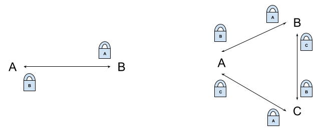
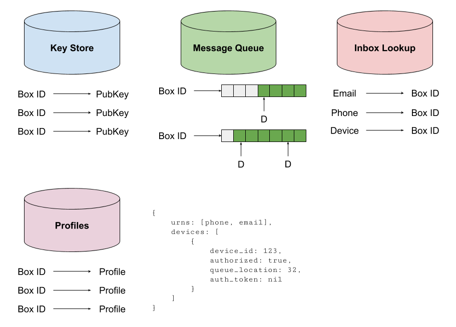

# Rossby

Rossby implements a distributed, encrypted message service that is intended to
be geo-replicated. Rossby's goal is to facilitate the sending and receiving of messages
while also ensuring that as much work as possible is pushed to the client side.
Requiring clients to handle most of the encryption and message management ensures that
rossby has as little detail as possible to be exposed to any security vulnerabilities.

## Requirements

### Required

- A user should be able to send and receive messages from multiple devices
- Users are identified by multiple phone numbers or email addresses
- Messages should either be sent person to person or to a group
- Private keys should remain on the device and never be transferred over the network
- Public keys should be stored on the system and able to be retrieved by contacts
- Deduplicate messages (?)

### Optional

- User should be able to send read receipts
- Users should be able to send typing indicators
- User should be able to block other users
- Users should be able to allow or disallow receiving messages from anyone
- Users should be able to verify other users by exchanging a safety number
- Users should be able to send pictures and locations (and other rich media)

## Messaging Context

A goal of our system is to ensure that as much work is done on the client-side as possible to ensure as much security as we can manage.

Person to person (basic case):

A encrypts message with B’s public key then sends to B’s message queue. If A doesn’t have B’s public key, A requests it from the key store. Only B will be able to decrypt the message before it leaves A’s phone.

Groups (complex case) 2 options:

1. Create per-group keys that have to be shared with all members of the group
2. Send messages to each member of the group encrypted with their public key

Because keys should not be exchanged over the network, we will go with option 2.

## Data Storage

All data stores are partitionable key-value stores that are perfect for demonstrating geo-replication with Alia. Because of strong consistency requirements and inter-object relations, this is a very good geo-distributed system example.

Each user has a unique inbox and is identified by a GUID - Box ID. The BoxID is the basic unit of relation and other tables are partitioned to ensure optimal reads. The inbox lookup is a read/insert/delete only mapping of a user identifier (e.g. phone number, email, or device) to the Box ID. The key store is a read/update/insert only mapping of the box id to the public key; note that the system only maintains a single public key per box at any given time.

The profiles table and the message queue are the two tables that are updated the most often. The profiles table has metadata related to the state of messaging for the user. The message queue has messages appended to it for delivery to devices.

Each device tracks what messages have been delivered to it via the device pointers. Once the message has been delivered to all devices the queue can be cleaned up. This ensures that the server does not store messages for all time and we don’t incur large data storage costs. We can also expire messages if they’ve been in the queue for too long and are held up by an offline device.

Should we just put the public key into the profile?

## API

`Register`

- Send: device, phone/email, public key
- Server: store data, mark unauthorized, send unique code, acknowledge the request.
- Error: phone/email already in box id table or pub key table (link devices instead)

`Authorize`

- Send: device, auth key
- Server: mark authorized (note: no username/password)
- Respond: send device token encrypted by client public key

`Fetch Messages`

- Send: device, box id, hawk authentication with unique token
- Server: retrieve messages, update device pointer (on send or confirm?)
- Respond: messages, status
- Error: request is unauthenticated by hawk token
- Client: decrypt messages with private and add to each chatbox

`Request Key/Profile (add contact)`

- Send: phone number/email, hawk authentication with unique token
- Server: check permissions for contacts
- Respond: profile/public key for user
- Error: no user, not authorized, (if not allowed to discover contact, send no user)

`Send Message`

- Client: encrypt message(s) with recipient public key
- Send: recipient(s), encrypted message(s), haw authentication with unique tokens
- Server: enqueue messages in inboxes, acknowledge the request
- Error: request unauthenticated, unknown recipient (also case iff blocked)
